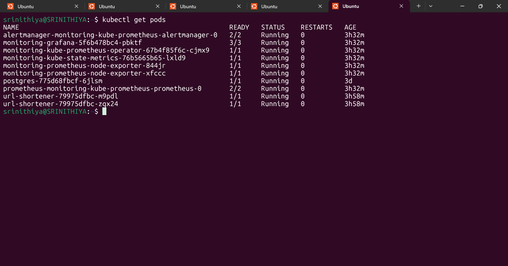
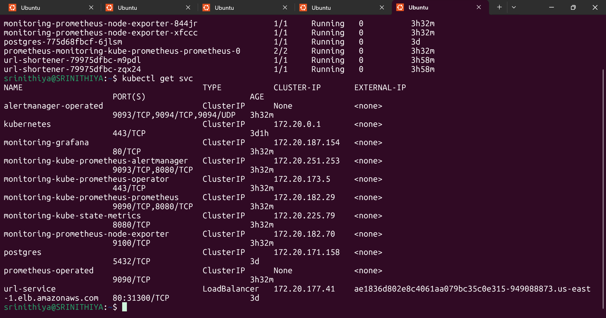
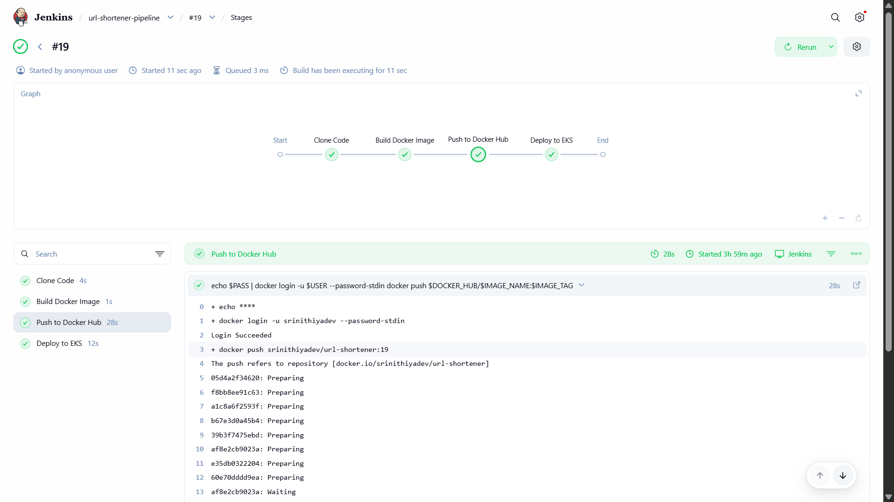
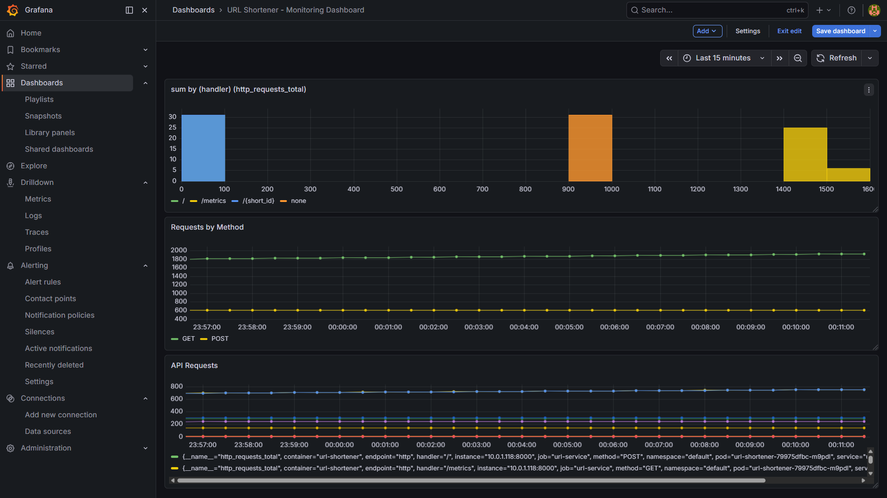
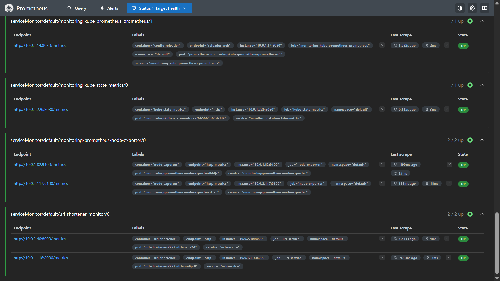

# URL Shortener DevOps Project (CI/CD, Kubernetes, Monitoring)

## Overview

This project demonstrates a complete end-to-end DevOps pipeline by deploying a URL Shortener application on AWS EKS.

It focuses on automation, scalability, and observability using Jenkins, Docker, Kubernetes, Prometheus, and Grafana.

---

## Problem Statement

Modern applications require scalable infrastructure, automated deployment, and real-time monitoring.

Manual deployment processes are inefficient and error-prone. This project addresses these challenges by implementing a fully automated CI/CD pipeline and production-style deployment.

---

## Features

* URL shortening service
* Dockerized application
* CI/CD pipeline using Jenkins
* Kubernetes deployment on AWS EKS
* LoadBalancer for external access
* Monitoring using Prometheus
* Visualization using Grafana

---

## Screenshots

### Kubernetes Deployment




### Jenkins Pipeline



### Grafana Dashboard



### Prometheus Monitoring



---

## System Architecture

User
→ AWS LoadBalancer
→ Kubernetes (EKS Cluster)
→ Application Pods (URL Shortener)
→ PostgreSQL Database
→ Prometheus
→ Grafana

---

## DevOps Workflow

Code → GitHub
→ Jenkins Pipeline
→ Docker Build
→ Push to DockerHub
→ Deploy to Kubernetes (EKS)
→ Monitor using Prometheus and Grafana

---

## Tech Stack

### Backend

* Python (FastAPI / Flask)
* PostgreSQL

### DevOps & Cloud

* Docker
* Kubernetes (AWS EKS)
* Jenkins
* DockerHub

### Monitoring

* Prometheus
* Grafana

---

## Installation (Local Setup)

```bash
git clone https://github.com/srinithiyadev/url-shortener-devops.git
cd url-shortener-app

pip install -r requirements.txt
python main.py
```

---

## Docker

```bash
docker build -t url-shortener .
docker run -p 8000:8000 url-shortener
```

---

## Kubernetes Deployment

```bash
kubectl apply -f k8s/deployment.yaml
kubectl apply -f k8s/service.yaml
kubectl apply -f k8s/postgres.yaml
```

---

## Future Enhancements

* Terraform-based EKS provisioning
* Auto-scaling using HPA
* Alerting using Alertmanager
* Multi-environment deployment

---

## Author

Srinithiya M
